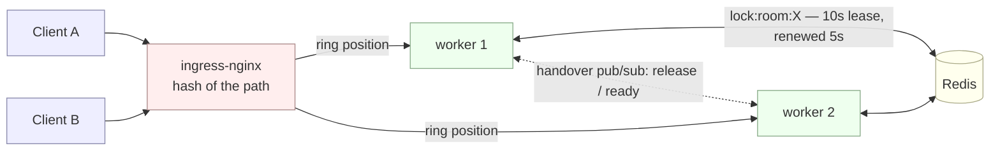
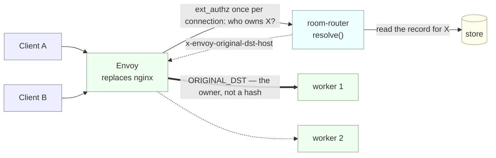
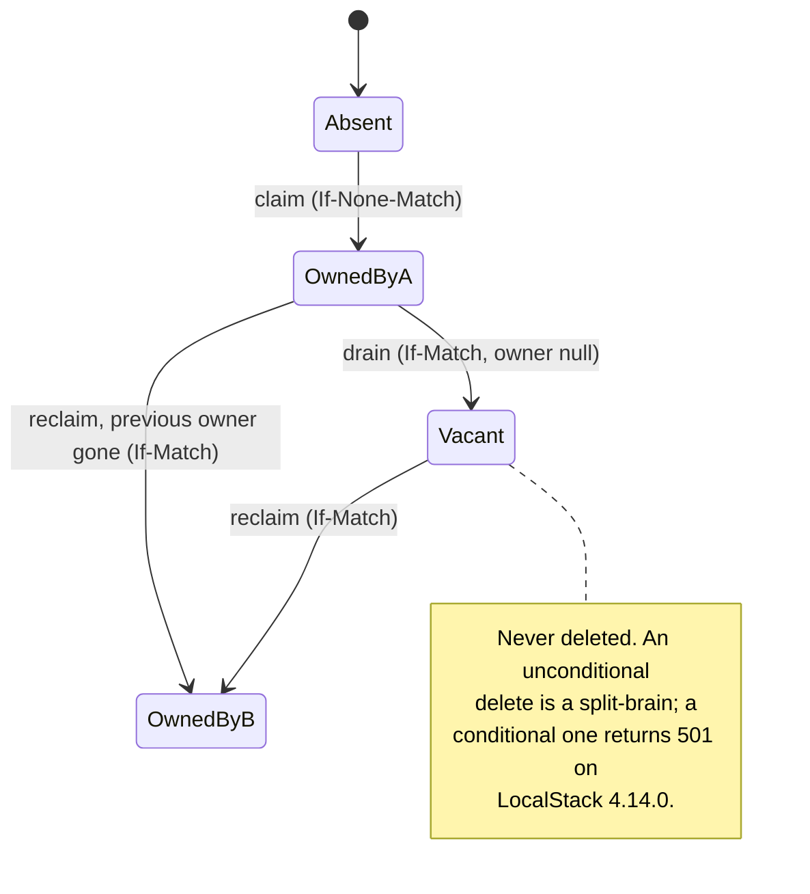
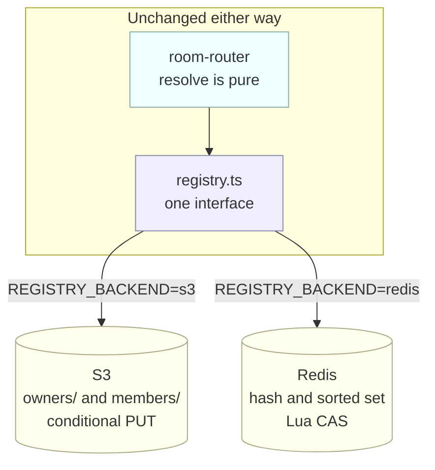
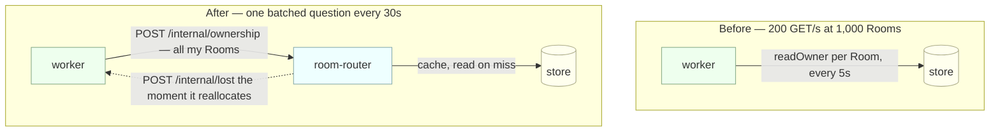
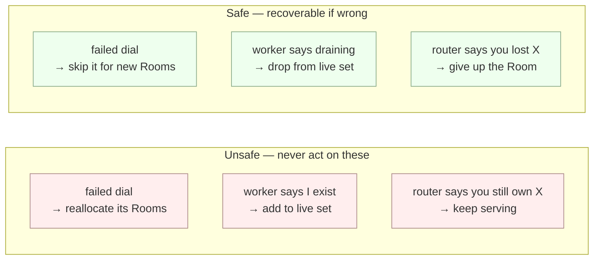

# Approaches and measurements

**TL;DR** — Removing Redis was never what fixed scaling. Making routing resolve an **authoritative record** instead of hashing a path is what took Room movement on a scale-up from 26 to 0. Where that record lives (bucket or Redis) changes cost and latency but not the result. Every number below came from `tldraw-client/scale-drill.mjs` against `local-cluster`, and two of the measurements were wrong before they were right — both are kept here, because how they lied is the useful part.

---

## 1. Where we started: routing is a hint

`ingress-nginx` hashes `$uri` onto a consistent-hash ring. The ring reshuffles on every scale event, so Sessions of one Room routinely reach a worker that does not own it. A Redis lock decides who really owns it, and a two-phase handover over pub/sub moves ownership between two *live* workers while clients are connected.



**Measured — 24 Rooms, 2→3→4→3→2:**

| Step | Rooms moved | Sessions disrupted | Recovery p50 | Connect p50 |
|---|---|---|---|---|
| 2→3 up | **11/24 (46%)** | 11 | 506ms | 27ms |
| 3→4 up | **2/24 (8%)** | 2 | 507ms | 39ms |
| 4→3 down | **2/24 (8%)** | 2 | 766ms | 29ms |
| 3→2 down | **11/24 (46%)** | 11 | 781ms | 20ms |
| **Total** | **26** | **26** | | |

0 failed connects, 0 never recovered. Three things this shows:

- **Rooms moved equals Sessions disrupted, exactly, in every step.** Each Room the ring drags across costs one client a reconnect.
- **The path is mirrored — 11, 2, 2, 11.** Returning to N replicas restores the ring, so a scale up/down cycle pays twice.
- **Scale-down recovery is ~50% slower** (766–781ms vs 506–507ms): scaling up runs the coordinated handover, scaling down just drops the socket and lets the client back off.

Single-step runs, for the spread: 2→3 moved 50% (12 Rooms), 21% (24 Rooms); 2→4 moved 63%. Theory says ~33% and ~50%; nginx's ring has limited virtual nodes and does not spread evenly at this size.

---

## 2. The change that mattered: routing resolves a record

Envoy asks a small stateless **room-router** who owns the Room, once per connection, and routes to that exact worker. **Envoy replaces ingress-nginx rather than sitting behind it.** Because a live worker never receives a connection for a Room another live worker owns, the whole handover protocol is deleted: ownership only moves when the previous owner is *gone*.



Ownership is one record per Room, and every transition is the same primitive — a conditional write:



**Measured — identical drill, 24 Rooms, 2→3→4→3→2:**

| | Hash ring | Record-resolved |
|---|---|---|
| Rooms moved | **26** | **0** |
| Sessions disrupted | **26** | **0** |
| Failed connects | 0/120 | 0/120 |
| Connect p50 | 20–39ms | 43–50ms |

**Read the scale-down rows carefully — they are a trap.** Every Room was claimed while only 2 workers existed, so scaling up gave the new workers nothing (correct), and Kubernetes then terminated *those same empty workers* on the way down. The drain path was never exercised. A truthful 0 that measured nothing.

Claiming the Rooms at 4 replicas and scaling **down** exercises it properly:

| Step | Rooms moved | Sessions disrupted | Recovery p50 |
|---|---|---|---|
| 4→3 down | 4/24 (17%) | 4 | 527ms |
| 3→2 down | 5/24 (21%) | 5 | 531ms |
| **Total** | **9** | **9** | |

So the honest headline is **scale-up became free**, not *scaling became free*. Scale-down still disturbs the Rooms a terminating worker actually held — bounded by what it owned, rather than by a ring reshuffle.

**Crash path**, force-killing the worker that owned the most Rooms with `--grace-period=0 --force` (no drain, nothing persisted or vacated):

| | |
|---|---|
| Rooms the victim owned | 7 |
| Reclaimed by another worker | **7/7** |
| Left stale | **0** |

---

## 3. Tweak: which store holds the record?

The record has to live somewhere, and that is separable from routing resolving it. Both backends were built behind one interface and run on the same cluster with the same drill.



**Measured:**

| | S3 | Redis |
|---|---|---|
| Rooms moved / disrupted | **0 / 0** | **0 / 0** |
| Failed connects | 0/120 | 0/120 |
| `resolve()` mean, isolated | **11.6ms** | **0.55ms** |
| `resolve()` under 5ms | 50/120 | **126/126** |
| Connect p50, end to end | 43–50ms | 36–51ms |
| Contract tests passed | 19/19 | 17/17 |

**Redis is ~21× faster at the store read, and it barely shows.** A resolve is roughly a quarter of connect cost; the rest is the WebSocket handshake, Envoy and `TLSocketRoom` setup, so end-to-end latency stays inside run-to-run noise. The latency argument for Redis is true and largely irrelevant.

Both backends were verified against the real thing, not just mocks — the unit tests re-implement the Lua rather than executing it, so they could not prove the scripts even parse:

- **S3 against LocalStack 4.14.0** — claim, conflict, stale-etag rejection, CAS reallocation, vacate-to-null, vacated-vs-absent. Also established that `LastModified` is **second-granular**: three writes inside one second all report the same timestamp, each up to 999ms *older* than the write. An 8s `MEMBER_TTL` is really ~7s of margin.
- **Redis against Redis 7** — same cases via version-counter CAS. Clock translation measured at **1ms**, against S3's up-to-999ms truncation.

What actually separates them is cost, and failure mode. Redis splits liveness from the ability to persist, which is why the **persistence health check** exists — see §5.

---

## 4. Tweak: who answers "do I still own this?"

The dominant line in the request bill was every worker re-reading every Room it held, every 5 seconds. Moving that to the router — and having the router **push** a loss the moment it takes a Room away — makes a 30s backstop safe.



**Measured — 24 Rooms held, steady state, 60 seconds:**

| | `GetObject` / min |
|---|---|
| Per-Room re-check, 5s | **288** *(derived: 24 Rooms ÷ 5s)* |
| Router-served, 30s backstop | **48** *(measured)* |

**6× fewer reads.** 48 is exactly 2 workers × 2 polls × 12 Rooms, which is how we know the path is live rather than silently skipped. Membership polling ran alongside at 2.05 `ListObjectsV2`/s — 2 routers plus 2 workers, each every 2s.

Drill results with the change: still **0 moved / 0 disrupted** on the up-down cycle; drain still works (14 moved, 14 disrupted, all recovered ~538ms, 0 failed connects).

**The push fired 0 times in every drill, and that is correct.** A cleanly draining worker vacates its records first, so the reallocating router sees `owner: null` and there is nobody to tell. A crashed worker cannot receive one. The push exists for the one case neither covers: a router with a **stale member view** reallocating a Room from a worker that is genuinely alive. Rare, hard to trigger deliberately, and the only thing that catches it — which is exactly why it is what makes a 30s backstop safe. Four unit tests cover it because the drills cannot.

**The saving is the interval, not the endpoint.** Workers poll 30s apart and the router's cache TTL is 3s, so every query is a miss today. The endpoint's value is that it makes the next optimisation possible: batching those per-Room GETs into one `ListObjectsV2` with ETag comparison. At 24 Rooms that is not worth it (2 LISTs ≈ 24 GET-equivalents against 48 GETs, and S3 prices a LIST like a PUT). At 1,000 Rooms it is ~2,000 GET/min → ~4 LIST/min, which is where the money is.

---

## 5. Tweaks that changed no metric, and exist to stop a bad one

Three rules, all the same shape: **a signal may be acted on in the direction that is recoverable, never in the direction that is not.**



- **Reachability informs routing, never ownership.** A router that cannot dial a worker stops offering it *new* connections but leaves the live set and the records alone. Refusing to route is recoverable; reallocating ownership is not.
- **Push is safe removing, unsafe adding.** "I am leaving" is conservative and degrades to the poll if missed. "I exist" makes two routers disagree, and a router with a partial view reallocates a live worker's Rooms.
- **The persistence health check.** Ownership says a worker *may* hold a Room; being able to save is what makes that worth anything. With the bucket those were one question — the heartbeat and the Snapshot went to the same place. With Redis they are not, so after three consecutive failed Snapshot writes a worker vacates its Rooms and fails its liveness probe. It tests the capability rather than inferring it, and is arguably better than the property it replaces.

---

## 6. Tweak: allocation follows the weights

Allocation is weighted rendezvous now (see ADR 0005's amendment of 2026-08-21): each live member is scored `-w / ln(h)` with `w = 1/(1 + rooms)`, and the count rides inside the member key on S3 and the member entry on Redis, so no read got more expensive. Measured with the drill's spread mode — pin the fleet to one worker, preload it with 12 held Rooms, scale to 3, then burst 24 fresh Rooms and compare where they land against what the member records predict:

```
node scale-drill.mjs --spread --preload 12 --to 3 --rooms 24
```

**Measured — 12-room preload, 3 workers, 24-room burst:**

| worker | rooms before | weight | expected share | won |
|---|---|---|---|---|
| preloaded | 12 | 0.077 | 3.7% | **0/24** |
| fresh A | 0 | 1.000 | 48.1% | 8/24 |
| fresh B | 0 | 1.000 | 48.1% | 16/24 |

- **Unweighted rendezvous would have handed the loaded worker ~8 of the 24.** It took 0, against a static-weight expectation of 0.9. That is the behaviour the amendment claims: a loaded worker stops attracting new Rooms until the fleet catches up.
- **The fresh pair's 8/16 split is noise, not bias.** Conditional on 24 Rooms reaching the pair, the expected split is 12/12 with σ≈2.4; 8 is ~1.6σ out — one draw of a small sample, and the sample is small by design. The `RUN` suffix makes each run a fresh draw, so re-runs wobble here and should.
- **The preload never moved** — 12 Rooms before, 12 after. Scaling up still disturbs nothing; the weighting only shapes what did not exist yet.
- **0 failed connects**, and that number is load-bearing: the first execution of this drill printed an all-zero spread table that measured nothing, because every connect had failed — the running k3d cluster predated `k3d-config.yaml`'s 8081 mapping, so the host port was refusing connections while the in-cluster path was healthy. (`k3d node edit k3d-tldraw-local-serverlb --port-add 8081:8081` aligns an existing cluster without recreating it.) Same lesson as §7: a zero is only trustworthy next to the counter that would have caught the nothing it might be.

Paced allocation (`--pace N` waits N ms between Rooms so heartbeats update the weights mid-batch) is built but not yet measured; under pacing the static prediction becomes a floor rather than a target, because the fresh workers' weights fall as they win.

## 7. The harness, and the two times it lied

Every number above came from `tldraw-client/scale-drill.mjs`: hold N real `TLSyncClient` Sessions, walk a replica path, open a fresh Session per Room at each step to force re-resolution, and record what the held Sessions felt. Ownership is read from whichever store is in use, so one drill covers all three designs.

Both of these produced clean-looking results that were wrong. They are worth more than the results that were right.

**A raw WebSocket is not a Session.** The first harness used bare sockets and reported a tidy `0/12 rooms moved`. `TLSocketRoom` prunes a session that has not sent a connect message within 10s, so every "held" socket died at exactly 10.0s — before the scale event finished. The drill was measuring nothing. Fixed by using the real sync client, the same engine `useSync` runs in the browser.

**A zero can be the bug.** The first request-rate measurement showed **0 `GetObject`** — apparently a perfect result. `ROUTER_INTERNAL_URL` pointed at the router Service on port 8081, which targets **Envoy on 8080**, so every ownership query was proxied to a random *worker*, 404'd, and failed open silently. The re-check was doing nothing at all, and the metric read as a 6× improvement. Fixed with a separate `-router-internal` ClusterIP Service (kept off the public LoadBalancer, since those endpoints are unauthenticated) and a loud error on any non-OK answer — silent fail-open is indistinguishable from healthy.

Both share a lesson worth keeping: **a measurement that improves without the mechanism being exercised is the most expensive kind of wrong.** Check that the number moved for the reason you think it did — 48 GETs being exactly `2 workers × 2 polls × 12 Rooms` is what made the second measurement trustworthy.

---

## Everything in one table

| Design | Rooms moved (up) | Rooms moved (down) | Disrupted | Recovery p50 | Connect p50 | Store reads |
|---|---|---|---|---|---|---|
| Hash ring + Redis lock | 13/48 | 13/48 | 26 | 506–781ms | 20–39ms | Redis, per lock op |
| Record-routed, S3 | **0/48** | 9/48 † | 9 | 527–531ms | 43–50ms | 11.6ms/resolve · 288 GET/min |
| Record-routed, Redis | **0/48** | not run | 0 | — | 36–51ms | 0.55ms/resolve |
| Record-routed, S3, router re-check | **0/48** | 14/48 † | 14 | ~538ms | 35–54ms | **48 GET/min** |

† measured on a 4→3→2 run, where the terminating workers actually held Rooms.

**Not measured, and it matters:** none of this has been load tested. Everything above ran 24 Rooms on a laptop k3d cluster.

The obvious bar to clear is the `~7,000 concurrent connections` figure in [`../stress-test/README.md`](../stress-test/README.md) — but **that benchmark does not measure what its headline implies**, and the same trap described in §7 is why. The k6 script opens a WebSocket and sends `{type: "push"}` without ever sending a `connect` message, so `TLSocketRoom` prunes every session at ~10s. Run against this cluster at 4 VUs it reports:

| k6 says | actually happened |
|---|---|
| `ws_connections_success: 19`, `failed: 0` | 100% "success" |
| all three thresholds green | test passes |
| `iteration_duration: min=10.01s` | configured for 30s; every session died at 10s |
| `ws_errors: 19` | **one error per connection** — every `push` rejected |

So 7,000 is a real number about **WebSocket handshake and load-balancer capacity**, which is worth knowing, and *not* a number about sustained collaborative sessions. Nothing in this repo has ever measured the latter at scale, on either design.

Closing that gap means fixing the harness first — k6 has no `@tldraw/sync-core`, so it would need to speak the connect handshake directly (`{type: "connect", connectRequestId, schema, protocolVersion, lastServerClock}`) or be replaced by a Node driver built on the real client, as `scale-drill.mjs` is. Until then, treat every load number in this repo as connect-rate only.
